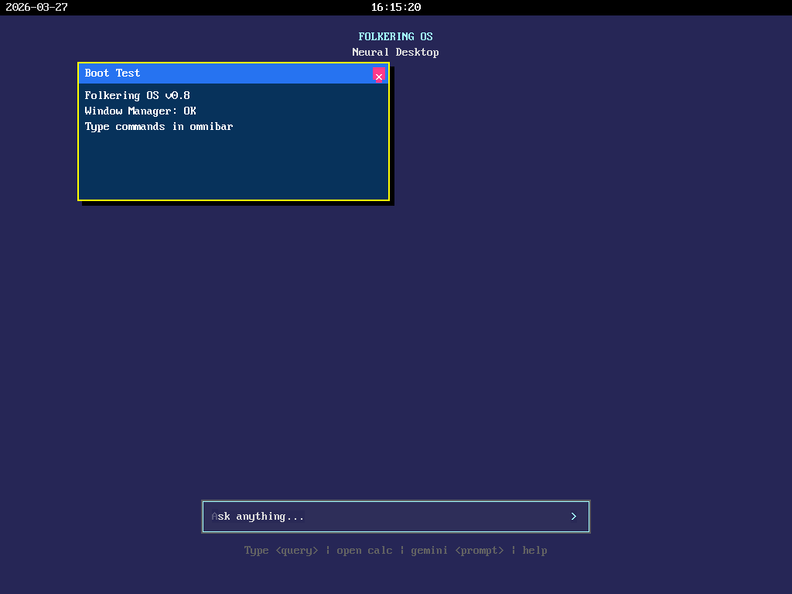
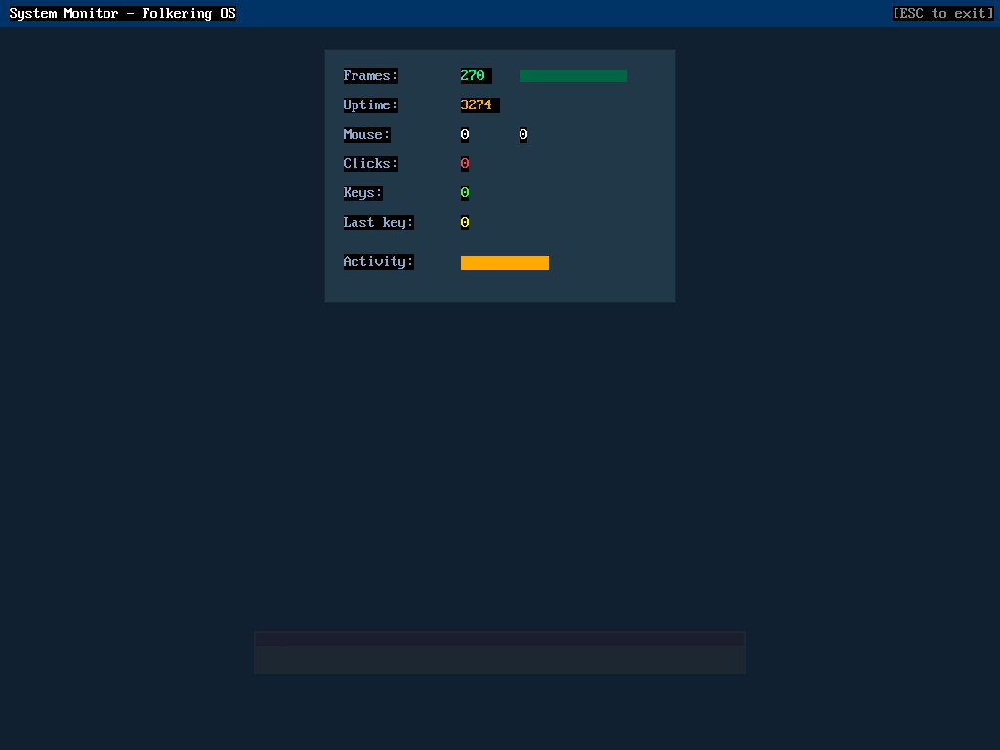

# Folkering OS

**An AI-native operating system written from scratch in Rust.** Built on a microkernel architecture where AI inference is a first-class kernel service, not an afterthought.

Folkering OS runs on bare-metal x86-64 hardware (via QEMU) with its own kernel, compositor, shell, filesystem, IPC system, and a complete on-device SLM inference engine. No libc, no POSIX, no Linux — pure `no_std` Rust from bootloader to token generation.

## Screenshots

| Neural Desktop | System Monitor (WASM App) |
|:-:|:-:|
|  |  |

*Left: Neural Desktop with cascading WASM app windows and omnibar. Right: Interactive System Monitor — a WASM app running at 60fps with live uptime, frame counter, and activity bars. All rendered on bare metal via wasmi interpreter.*

## What It Can Do Today

```
> ask hi
[AI] <think>Okay, the user said "hi". I need to respond</think>
  Hello! How can I help you today?
  <Qwen3-0.6B generates coherent text with reasoning>

> gemini draw a green rectangle on the screen
[cloud] Sending with UI context...
[AI] Generating tool: draw a green rectangle...
[AI] Tool executed: 1 draw + 0 text commands
  → Green rectangle appears on framebuffer!
  (Gemini 3 Flash → Rust code → WASM compile → wasmi execute → render)

> open calc
  → [Calculator] WASM-powered app with button grid

> gemini make an interactive app where a circle follows the mouse
[cloud] Sending with UI context...
[AI] Generating tool: interactive app...
[AI] Tool executed: persistent WASM app activated
  → Circle tracks mouse in real-time! (folk_poll_event → per-frame loop)
  → ESC to exit, fuel resets each frame (1M instructions)
```

## Architecture

Six userspace services communicate via synchronous IPC over shared memory:

```
                    +------------------+
                    |    Compositor    |  GPU framebuffer, window manager,
                    |   (Task 4)      |  omnibar, terminal, mouse/keyboard
                    +--------+---------+
                             |
              +--------------+--------------+
              |                             |
     +--------+---------+         +--------+---------+
     |  Intent Service  |         | Inference Server |
     |   (Task 5)       |         |   (Task 6)       |
     |  Command routing |         |  SLM, tokenizer  |
     +--------+---------+         +------------------+
              |                             |
     +--------+---------+         +--------+---------+
     |      Shell       |         |     Synapse      |
     |   (Task 3)       |         |   (Task 2)       |
     |  Commands, WASM  |         |  SQLite, VFS     |
     +------------------+         +------------------+
              |                             |
     +--------+-----------------------------+---------+
     |              Folkering Kernel                  |
     |  SYSCALL/SYSRET, preemptive scheduler, APIC   |
     |  VirtIO DMA, shmem, mmap, IPC, page tables    |
     +------------------------------------------------+
```

### The App Weaver

Shell builds UI declaratively and sends it to Compositor via shared memory:

```rust
// Shell builds a widget tree (no GUI code!)
let mut w = UiWriter::new(&mut buf);
w.header("My App", 280, 160);
w.vstack_begin(6, 3);
  w.label("Hello from Shell!", 0x00CCFF);
  w.hstack_begin(8, 2);
    w.button("OK", 1, 0x226644, 0xFFFFFF);
    w.button("Cancel", 2, 0x664422, 0xFFFFFF);

// Serialize to shmem, send via IPC → Compositor renders it
// Button clicks route back to Shell as action_id events
```

Apps never touch pixels. Compositor renders. Shell weaves.

### On-Device AI Inference

The inference engine runs as Task 6 — a dedicated userspace service with its own 8MB arena, KV-cache, and BPE tokenizer. The full pipeline:

```
User types "ask hi" in Omnibar
     │
     ▼
Compositor creates shmem with prompt text
     │  IPC send (shmem handle + length)
     ▼
Inference Server (Task 6):
  1. BPE tokenize (Greedy Prefix Match, ▁-aware)
  2. Prepend BOS token
  3. Prefill: N tokens × 30 layers forward pass
  4. Generate: autoregressive loop (max 64 tokens)
     - Q4_0/Q8_0 GEMM, RMSNorm, RoPE, SiLU-gated FFN
     - KV-cache with sink-token eviction
     - Top-P nucleus sampling + repetition penalty
     - Logit clamping (ULTRA 31)
  5. Write response to shmem, reply via IPC
     │
     ▼
Compositor displays generated text in terminal window
```

Model: Qwen3-0.6B (Q4_0, 364MB) loaded from VirtIO disk via DMA bursting. Produces coherent reasoning with `<think>` tags.

### Hybrid AI: Cloud + On-Device

Folkering OS combines local SLM inference with Gemini 3 Flash cloud API:

- **On-device**: Qwen3-0.6B for private reasoning and text generation
- **Cloud**: Gemini 3 Flash via COM2 serial proxy for complex tasks (intent parsing, code generation)
- **WASM JIT Toolsmithing**: Ask Gemini to generate a tool → Rust code → compile to WASM → execute on bare metal
- **Interactive WASM Apps**: Keywords like "game/app/click/mouse/tetris" trigger persistent mode — `PersistentWasmApp` keeps Store/Instance/Linear Memory alive between frames, `folk_poll_event` routes real-time mouse + keyboard input, `run()` is called every frame with fuel reset (1M instructions)

```
User: "gemini draw a green rectangle"
  → Gemini 3 Flash: {"action": "generate_tool", "prompt": "draw a green rectangle"}
  → Proxy: Gemini code-gen → Cargo compile → 153 byte WASM → base64
  → OS: base64_decode → wasmi execute → folk_draw_rect() → framebuffer
  → Green rectangle on screen!

User: "gemini make a game where a ball bounces around"
  → Persistent WASM app: static mut variables survive between frames
  → folk_poll_event() returns FolkEvent (16-byte struct) for mouse/keyboard
  → Per-frame execution loop, ESC kills app, trap/out-of-fuel auto-deactivates
```

The serial proxy (`serial-gemini-proxy.py`) handles the full toolchain autonomously:
temp Cargo workspace with `opt-level="z"`, `lto=true`, `strip=true` → minimal WASM binary.

Folk API: 12 host functions including `folk_draw_rect`, `folk_draw_line`, `folk_draw_circle`, `folk_fill_screen`, `folk_draw_text`, `folk_screen_width/height`, `folk_random`, `folk_get_time`, `folk_poll_event`.

### Semantic VFS

Files live in a SQLite database on a VirtIO block device. Synapse (the "data kernel") provides file listing, content reading, and text search — all via IPC:

```
Compositor → Intent Service → Shell → Synapse → SQLite (VirtIO)
     ^                                              |
     └──── shmem results (zero-copy) ──────────────┘
```

### Shared Memory (shmem)

Zero-copy data transfer between tasks. Each task has its own page table — `shmem_map` maps physical pages into the correct PML4:

```rust
let handle = shmem_create(4096)?;      // allocate physical page
shmem_grant(handle, target_task)?;     // grant access
shmem_map(handle, 0x30000000)?;        // map into MY page table
// ... write data ...
shmem_unmap(handle, 0x30000000)?;      // unmap
// Target task maps same handle at their own virtual address
```

## Kernel Features

| Feature | Status | Details |
|---------|--------|---------|
| **Preemptive multitasking** | Done | Timer IRQ, priority scheduler, deadline support |
| **SYSCALL/SYSRET** | Done | SWAPGS + CpuLocal per-CPU storage |
| **FXSAVE/FXRSTOR** | Done | XMM/SSE state preserved across switches |
| **Page tables** | Done | Per-task PML4, HHDM, user/kernel separation |
| **Shared memory** | Done | Create, map, grant, unmap, destroy — correct page table |
| **SYS_MMAP/MUNMAP** | Done | Anonymous pages, chunked allocation (16MB/call) |
| **IPC** | Done | Synchronous send/reply, async recv, CallerToken |
| **VirtIO block** | Done | DMA burst reads (64 sectors/request), FOLKDISK header |
| **VirtIO network** | Done | DHCP, ICMP ping, DNS resolution |
| **VirtIO GPU** | Done | Modern PCI transport, 2D scanout, 1280x800 |
| **SMP (4-core)** | Done | Limine SMP, parallel GEMM, HHDM zero-copy |
| **Free-list allocator** | Done | Replaces bump allocator, supports dealloc, survives infinite WASM runs |
| **Serial I/O** | Done | COM1 log, COM2 Gemini proxy, COM3 God Mode Pipe |
| **I/O APIC** | Done | Keyboard + mouse + VirtIO interrupt routing |
| **Panic screen** | Done | Graphical panic with register dump, recursion guard |

## Userspace

| Component | Purpose | Lines |
|-----------|---------|-------|
| **Compositor** | Window manager, terminal, omnibar, AI intents, WASM execution | ~3500 |
| **Inference Server** | GGUF model loading, tokenizer, transformer, sampling | ~1000 |
| **Shell** | Command execution, WASM apps, IPC handlers | ~2400 |
| **Synapse** | SQLite parser, file cache, VirtIO persistence | ~1100 |
| **Intent Service** | Capability-based command routing | ~200 |
| **libtensor** | Q4_0/Q8_0 GEMM, RMSNorm, RoPE, KV-cache, GGUF, BPE | ~2200 |
| **libfolk** | Syscall wrappers, IPC, shmem, inference, UI protocol | ~1000 |
| **libsqlite** | Custom no_std SQLite B-tree reader | ~500 |

## UI Wire Protocol

Binary format for declarative UI trees (`libfolk/src/ui.rs`):

```
Header:  [magic:"FKUI"][ver:1][title_len:1][width:2][height:2][title:N]
Widgets: [tag:1][type-specific data][children recursively]

Tags: 0x01=Label, 0x02=Button, 0x03=VStack, 0x04=HStack, 0x05=Spacer
```

Zero-alloc serialization (`UiWriter`) and deserialization (`parse_widget`). No serde, no alloc — pure `no_std`.

## Building & Running

### Prerequisites

- Rust nightly (x86_64-unknown-linux-gnu target)
- WSL2 with Ubuntu (for cross-compilation and mtools)
- QEMU x86_64
- Python 3.12 (for MCP servers)

### Quick Start

```bash
# Build kernel + userspace + pack initrd + run QEMU
# (via MCP server tools — see folkering-mcp/server.py)
folkering_rebuild_run()

# Or manually:
cd kernel && cargo build --release
cd userspace && cargo build --release
cd tools/folk-pack && cargo run --release -- create boot/initrd.fpk ...
qemu-system-x86_64 -drive file=boot/current.img -serial file:serial.log -m 512M
```

### AI Model Setup

Folkering OS has been tested with [Qwen3-0.6B](https://huggingface.co/Qwen/Qwen3-0.6B) (Apache 2.0 license by Alibaba/Qwen team). Model files are **not included** in this repository — download separately:

```bash
# Download Qwen3-0.6B Q4_0 (~364MB) — recommended
# Model is licensed under Apache 2.0 by the Qwen team (Alibaba)
pip install huggingface-hub
huggingface-cli download Qwen/Qwen3-0.6B-GGUF --include "qwen3-0.6b-q4_0.gguf" --local-dir boot/

# Pack model into VirtIO disk (4KB-aligned)
cd tools/folk-pack && cargo run --release -- pack-model boot/virtio-data.img boot/model.gguf
```

Model loads via multi-sector DMA bursting (~60s for Qwen3-0.6B via TCG).

### Cloud LLM Setup (Gemini, OpenAI, or Claude)

The serial proxy supports multiple LLM providers. Copy `.env.example` and configure:

```bash
cp .env.example .env
# Edit .env — set LLM_PROVIDER, LLM_API_KEY, LLM_MODEL

# Supported providers:
#   gemini  — Google Gemini (default, free tier available)
#   openai  — OpenAI / ChatGPT (gpt-4o-mini, gpt-4o, etc.)
#   claude  — Anthropic Claude (claude-sonnet-4-20250514, etc.)
#   openai  — Local models via Ollama/LM Studio (set LLM_BASE_URL=http://localhost:11434/v1)

# Start the proxy (connects to QEMU COM2 on port 4567)
python tools/serial-gemini-proxy.py

# QEMU flags: -serial tcp:127.0.0.1:4567,server,nowait (COM2)
#             -serial tcp:127.0.0.1:4568,server,nowait (COM3)
```

### MCP Servers

**folkering-os** (build/run/interact):
- `folkering_rebuild_run` — full build→pack→boot cycle
- `folkering_screenshot` — GUI capture via QMP
- `folkering_interact` — scripted keyboard/mouse sequences

**folkering-debug** (live debugging):
- `tensor_dump` — read tensor data from inference engine
- `python_ref_runner` — PyTorch ground-truth oracle for comparison
- `attention_heatmap` — visual attention pattern analysis
- `topo_parity_map` — MSE/cosine drift analysis per layer
- `await_serial_log` — wait for regex pattern (eliminates blind sleep)
- `run_host_tensor_test` — test math on host (~1s vs 15min QEMU boot)
- `qmp_memory_dump` — read QEMU memory via QMP

## Roadmap

### Epoch 1: Cognitive Infrastructure (Current)

- [x] Phase 1-2: Kernel boot, PMM, paging, syscalls, user mode
- [x] Phase 3-5: IPC, shmem, capability system
- [x] Phase 6-8: Compositor, window manager, Neural Desktop
- [x] Milestone 2.3: IPC+shmem architecture (page table fix)
- [x] Milestone 3: Synapse SQLite integration, semantic VFS
- [x] Milestone 4: Interactive terminal, SYS_MMAP/MUNMAP, App Weaver
- [x] M26-M30: VirtIO network, DHCP, DNS, ICMP ping, TLS 1.3
- [x] M31-M32: GitHub API, JSON parser, clone-to-VFS
- [x] **M33-M41: libtensor** — Q4_0/Q8_0 GEMM, RMSNorm, RoPE, SiLU, KV-cache, GGUF parser, BPE tokenizer, transformer forward pass
- [x] **M42: First Words** — SmolLM2-135M generates tokens on bare metal
- [x] **M43: Qwen3-0.6B** — Coherent reasoning with `<think>` tags, proper BPE tokenizer
- [x] **SMP GEMM** — 4-core parallel output projection (0.57s/tok)
- [x] **VirtIO-GPU 2D** — Modern PCI Capabilities, 1280x800 scanout
- [x] **Neural Desktop** — Dirty rects, alpha blending, scaled fonts, intent engine, UI serialization
- [x] **Hybrid AI** — Gemini 3 Flash via COM2 serial proxy, intent parsing, autonomous actions
- [x] **WASM JIT Toolsmithing** — AI generates Rust → compiles to WASM → executes on bare metal
- [x] **Phase 2: Interactive WASM** — PersistentWasmApp with per-frame execution, folk_poll_event real-time input, free-list allocator, Bresenham line + midpoint circle algorithms, 12 Folk API host functions

### Next

- [ ] WASM tool persistence (save generated tools to Synapse VFS)
- [ ] Multi-turn conversation with Gemini (context window management)
- [ ] AVX2 GEMM acceleration for faster on-device inference

### Epoch 2-3: Agent-Native Paradigm (Vision)

1. **MIMO State-Space Scheduling** — Replace priority schedulers with predictive state-space models
2. **Generative Latent Memory** — Memory that reconstructs rather than retrieves
3. **Hyperdimensional I/O** — Semantic device abstraction via high-dimensional vectors
4. **Active Inference Immunity** — Security via free energy minimization, not signatures
5. **Declarative Intent Syscalls** — `SYS_DO_INTENT("summarize this")` — apps describe intent, OS implements

## Documentation

- **[ARCHITECTURE.md](ARCHITECTURE.md)** — Complete technical overview for developers
- **[CONTRIBUTING.md](CONTRIBUTING.md)** — How to contribute + CLA requirement

## Author

Knut Ingmar Merødningen — [ikkjekvifull@gmail.com](mailto:ikkjekvifull@gmail.com)

## License

Folkering OS is **dual-licensed**:

- **AGPL-3.0** ([LICENSE](LICENSE)) — Free for open-source use. If you modify Folkering OS and distribute it (including as a network service), you must release your source code under the same license.

- **Commercial License** — For proprietary, closed-source, or embedded use without AGPL obligations. Contact **ikkjekvifull@gmail.com** for enterprise licensing.

All contributors must sign a [Contributor License Agreement](CONTRIBUTING.md) (CLA) before pull requests are merged. This enables dual licensing while contributors retain their copyright.

**"Folkering OS"** is a trademark of Knut Ingmar Merødningen. Forks may not use the Folkering OS name or branding without permission.
