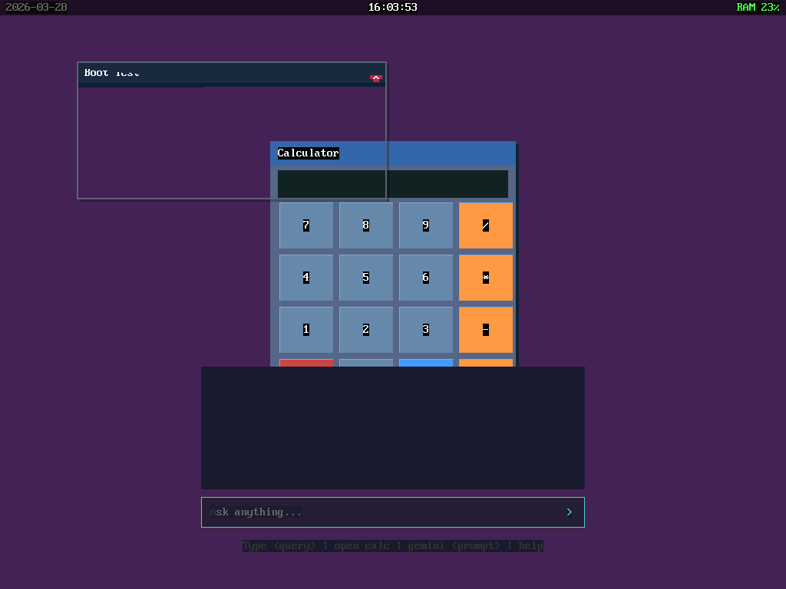

# Folkering OS

**The world's first AI-native bare-metal operating system that writes its own tools, generates its own drivers, and improves itself overnight.**

Built entirely in Rust `no_std` — no Linux, no POSIX, no libc. From x86-64 bootloader to AI desktop in 2 months. The AI isn't an app running on the OS. **The AI IS the operating system.**

## What Makes It Different

```
You type: Get-SystemStats |> Format-Dashboard

The OS:
1. Parses the pipe syntax (FolkShell AST)
2. Discovers "Get-SystemStats" doesn't exist
3. Asks Gemini to write it in Rust
4. Compiles it to WebAssembly (669 bytes)
5. Signs it cryptographically (SHA-256)
6. Discovers "Format-Dashboard" also doesn't exist
7. Generates THAT too (652 bytes, with visual rendering)
8. Signs it, chains the pipeline
9. Launches a live, interactive dashboard widget
10. All in ~10 seconds. From nothing.
```

**The terminal is not a text interface. It's an infinite canvas.**

## Architecture

```
┌─────────────────────────────────────────────────────────┐
│                    FolkShell                             │
│  Command |> Command ~> "semantic query" [Confidence: H] │
│  JIT Synthesis · Holographic Output · Spatial Pipelining │
├─────────────────────────────────────────────────────────┤
│  Compositor (wasmi 2.0)        │  On-Device SLM        │
│  40+ WASM Host Functions       │  Zero-latency local AI │
│  Semantic Streams (Tick-Tock)  │  Pattern matching brain│
├────────────────────────────────┼────────────────────────┤
│  Semantic VFS (Synapse)        │  Driver Runtime        │
│  SQLite + Intent JSON          │  DriverCapability SFI  │
│  query:// adapt:// mime://     │  MMIO · Port I/O · IRQ │
├────────────────────────────────┼────────────────────────┤
│  Rust no_std Microkernel                                │
│  SMP (4 cores) · VirtIO-GPU · smoltcp TCP/TLS 1.3      │
│  Intel VT-d IOMMU (10 DMA domains per device)          │
│  PCI Enumerate · IRQ Routing · DMA Allocation           │
└─────────────────────────────────────────────────────────┘
```

## Key Features

### FolkShell — AI-Native Semantic Shell
- **JIT Command Synthesis**: Unknown commands are auto-generated via LLM, compiled to WASM, and executed
- **Pipe Syntax**: `|>` deterministic pipes, `~>` fuzzy semantic pipes with cosine similarity
- **Holographic Output**: Commands return live WASM widgets instead of text
- **Spatial Pipelining**: Drag cables between floating windows to connect data streams

### Autonomous Driver Generation
- PCI device enumeration exposed to userspace
- Capability-gated port I/O (kernel validates every access against PCI BARs)
- 18 `folk_*` host functions for MMIO, interrupts, DMA, and device identity
- LLM synthesizes complete hardware drivers from PCI vendor:device IDs
- IOMMU per-device page tables for DMA isolation

### Semantic Virtual File System
- Files stored as semantic intents (JSON + MIME + vector embeddings)
- `query://calculator` — find files by concept, not path
- `adapt://json/csv/data.json` — format conversion via JIT-compiled WASM adapters
- View Adapter framework auto-generates data translators

### Cryptographic Lineage
- Every LLM-generated WASM binary is signed: `SHA-256(prompt + wasm_hash + timestamp)`
- OS verifies signature before execution
- Intention signatures bind code to the intent that created it

### AutoDream — Self-Improving Software
- **Draug daemon** monitors system health and improves apps overnight
- Three dream modes: Refactor (optimize), Creative (enhance), Nightmare (harden)
- **Digital Homeostasis**: only dreams when apps need improvement
- Morning Briefing for user approval of creative changes

### Intel VT-d IOMMU
- Hardware DMA isolation with per-device second-level page tables
- 10 isolated domains on q35 machine type
- AI-generated WASM drivers are physically prevented from corrupting kernel memory

### On-Device SLM
- Local pattern-matching brain for zero-latency AI responses
- Auto-complete, system introspection, command prediction
- "Spinal cord" (local, 0ms) / "Cerebral cortex" (cloud) architecture

## Screenshots

| Neural Desktop | Calculator | Paint |
|:-:|:-:|:-:|
|  |  |  |

## Tech Stack

| Layer | Technology |
|-------|-----------|
| Bootloader | Limine 8.7 |
| Kernel | Rust no_std, x86-64, SMP 4 cores |
| WASM Engine | wasmi 2.0.0-beta.2 (memory64, multi-memory, SIMD) |
| Graphics | VirtIO-GPU 2D, shadow buffer, zero-copy surface |
| Network | smoltcp TCP/IP, embedded-tls 1.3, DHCP, DNS |
| Storage | VirtIO-Blk, SQLite B-tree (custom no_std reader) |
| AI (local) | On-Device SLM pattern model |
| AI (cloud) | 4-tier: Ollama Qwen 7B → Gemini Flash Lite → Gemini Flash → Gemini Pro |
| IPC | Async message passing, shared memory, capability tokens |
| Security | SHA-256 WASM signing, IOMMU DMA isolation, SFI boundaries |

## Building

```bash
# Kernel
cd kernel && cargo build --release

# Userspace
cd userspace && cargo build --release

# Create initrd
cargo run --manifest-path tools/folk-pack/Cargo.toml -- create \
  boot/iso_root/boot/initrd.fpk \
  --add synapse:elf:userspace/target/x86_64-folkering-userspace/release/synapse \
  --add shell:elf:userspace/target/x86_64-folkering-userspace/release/shell \
  --add compositor:elf:userspace/target/x86_64-folkering-userspace/release/compositor \
  --add intent-service:elf:userspace/target/x86_64-folkering-userspace/release/intent-service \
  --add inference:elf:userspace/target/x86_64-folkering-userspace/release/inference

# Inject into boot image
py -3 tools/fat_inject.py

# Run (Windows with WHPX)
powershell tools/start-folkering.ps1

# Run (with IOMMU)
bash tools/start-folkering-q35.sh
```

## Project Stats

- **~30,000+ lines** of Rust (kernel + userspace)
- **40+ WASM host functions** across 3 runtimes (apps, drivers, adapters)
- **10 IOMMU DMA domains** with per-device page tables
- **0 bare `unwrap()`** in compositor — all error handling uses safe fallbacks
- **wasmi 2.0** with memory64, SIMD, multi-memory
- **2 months** from first boot to complete AI-native desktop

## License

MIT

## Author

Knut Ingmar Merødningen — [meray.no](https://meray.no)
