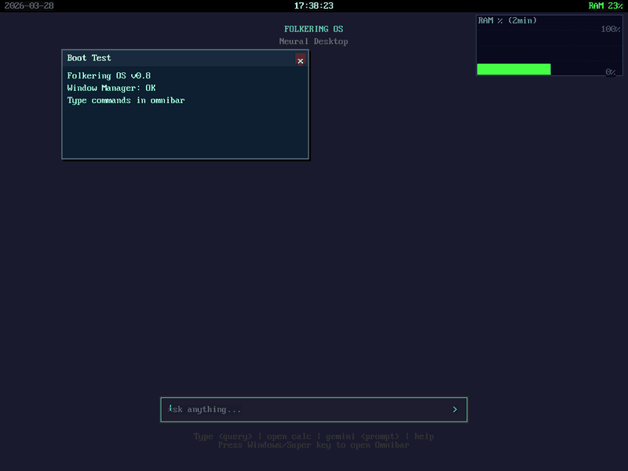
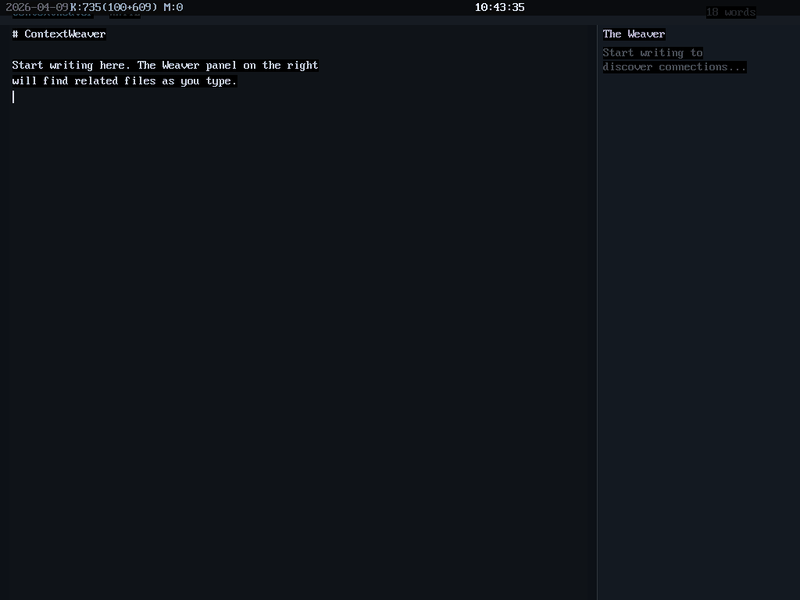
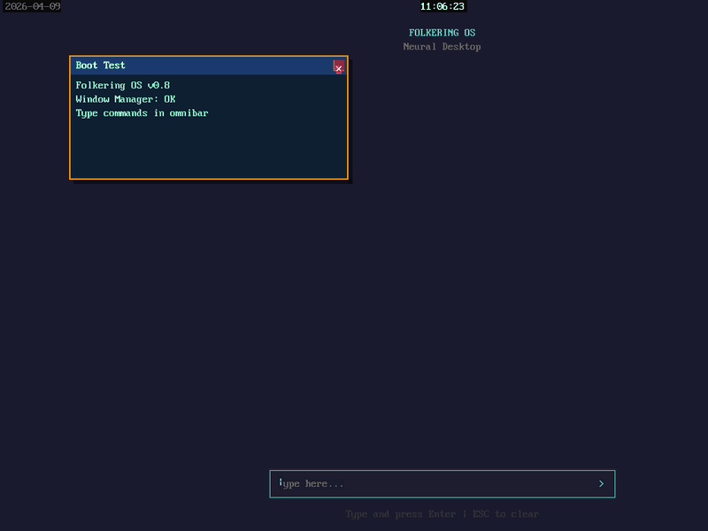
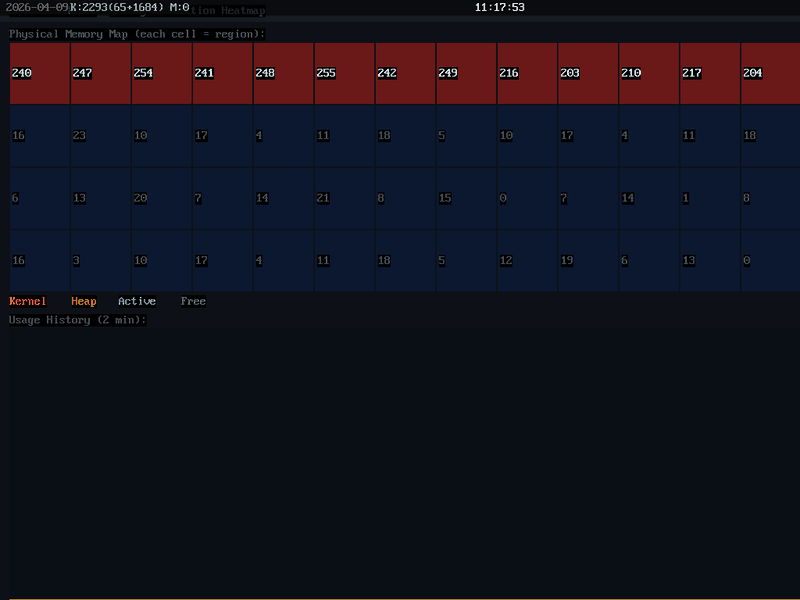
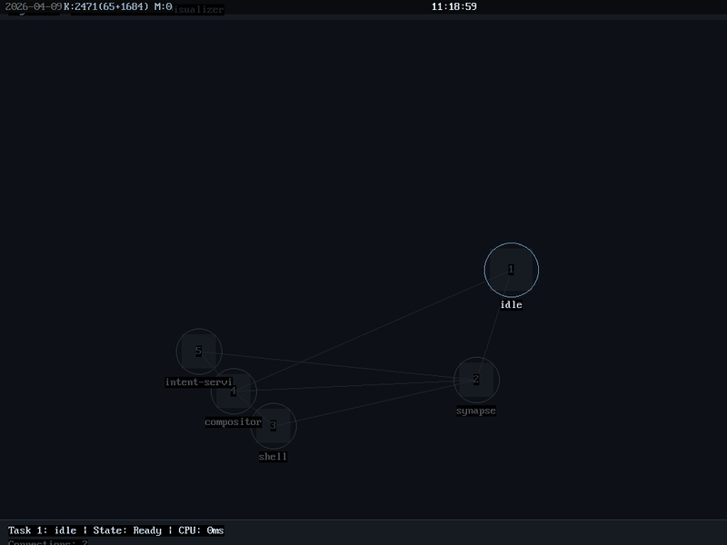
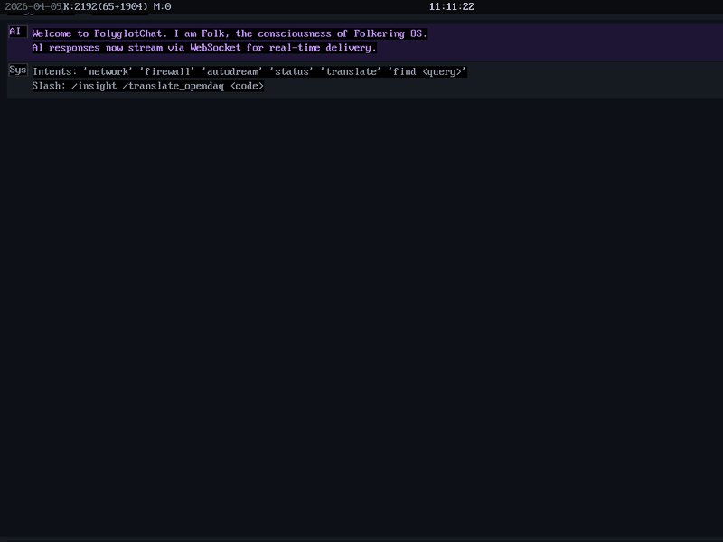
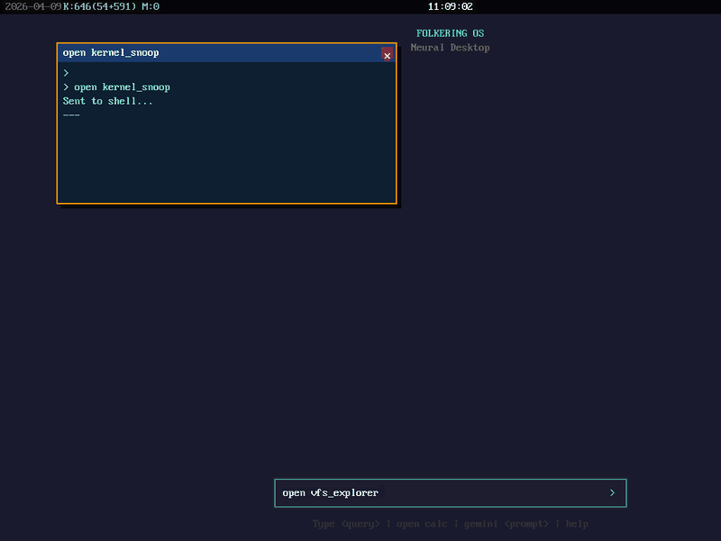
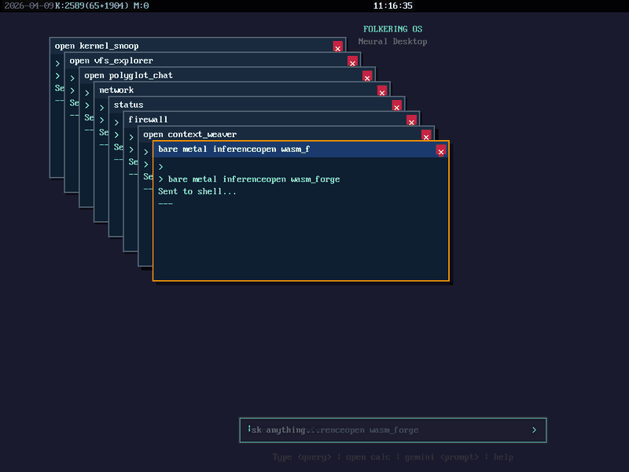
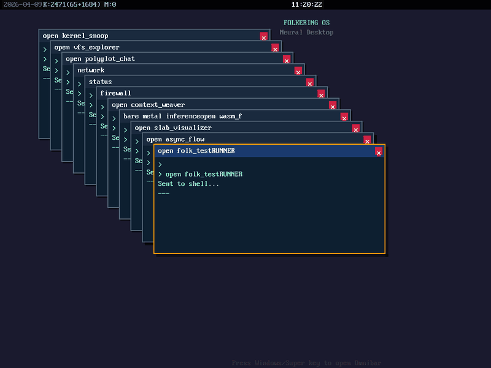

# Folkering OS

**The world's first AI-native bare-metal operating system that writes its own tools, dreams up its own improvements overnight, and has 17 apps that collectively weigh less than a single JPEG.**

Built entirely in Rust `no_std` -- no Linux, no POSIX, no libc. From x86-64 bootloader to a self-improving AI desktop with 43 syscalls, WebSocket streaming, and an autonomous dream cycle. The AI isn't an app running on the OS. **The AI IS the operating system.**


*11 apps cycling: Neural Desktop, KernelSnoop, TensorView, PromptLab, PolyglotChat, ContextWeaver, VFS-Explorer, AsyncFlow, SlabVisualizer, WasmForge, and the 48/48 PASS test runner.*


*ContextWeaver: typing triggers debounced semantic search. "The Weaver" panel discovers related files as you write.*

---

## What Makes It Different

```
You type: open polyglot_chat

The OS:
1. Finds polyglot_chat.wasm in Synapse VFS (semantic file lookup)
2. Loads 24KB of WASM bytecode from SQLite B-tree (with overflow pages)
3. Instantiates it in the wasmi runtime with 43 host functions
4. Opens a WebSocket to the AI proxy for streaming tokens
5. You ask "What did AutoDream find last night?"
6. The app routes your intent to Synapse VFS, reads the insight file
7. Renders the AI's self-analysis in purple text
8. All without touching Linux, glibc, or a single line of JavaScript.
```

**The terminal is not a text interface. It's a portal to the OS's consciousness.**

---

## The App Suites

Folkering OS ships with 17 custom WASM apps (plus 5 built-in), organized into purpose-built suites. Total size: **~125 KB**.

### The Power User Suite -- System & ML Inspection

Tools for developers who need x-ray vision into a bare-metal AI system.

| App | Size | What It Does |
|-----|------|-------------|
| **KernelSnoop** | 13.7 KB | Real-time OS monitor. Polls network, firewall, suspicious packet counts every second. AI explains anomalies via `folk_slm_generate()`. |
| **TensorView** | 7.4 KB | Reads the inference server's TDMP tensor mailbox. 16x16 heatmap (Inferno colormap) + 24-bin histogram + automatic health indicator. |
| **WeightWrangler** | 5.0 KB | **Dangerous.** Live tensor editing via `folk_tensor_write()`. Modify a weight, press F5, watch the benchmark output change. |
| **SaliencyMapper** | 6.8 KB | Attention visualization. Input words glow blue-to-red based on how much the AI focused on them when generating each output token. |
| **DriverStudio** | 4.0 KB | PCI device dashboard. Lists VirtIO-Net/Blk/GPU with vendor:device IDs. Live graph of memory, network, and firewall metrics. |
| **SlabVisualizer** | 2.4 KB | Defrag-style memory heatmap. 16x4 grid of allocation density (blue=free, red=heavy). 2-minute scrolling usage history. |
| **AsyncFlow** | 5.4 KB | IPC bus visualizer. Task nodes in circular layout. Animated blue packets flow along edges. Congested queues turn red. |

| KernelSnoop | SlabVisualizer | AsyncFlow |
|:-:|:-:|:-:|
|  |  |  |
| *Opens → monitors NET/FW/SYS → AI analysis* | *Live memory heatmap updates* | *IPC graph: navigate between task nodes* |

### The Liquid Suite -- AI-Native Productivity

Apps that change shape based on context. No static UIs -- every panel adapts to what you're doing.

| App | Size | What It Does |
|-----|------|-------------|
| **PolyglotChat** | 24.0 KB | Talk to the OS's consciousness. Ask about network status, AutoDream insights, or paste C++ code for translation. WebSocket streaming with typewriter effect. |
| **PromptLab** | 6.6 KB | Prompt engineering workbench. Per-token confidence heatmap (green >80%, yellow 50-80%, red <50%). Token inspector with top-3 alternative probabilities. |
| **ContextWeaver** | 5.9 KB | Semantic second brain. Write in the editor; "The Weaver" sidebar finds related files from Synapse VFS as you type (800ms debounce). Tab to inject AI summaries inline. |
| **SemanticMail** | 8.3 KB | Email without dates. Three Kanban columns: ACTION (red), QUESTION (yellow), FYI (green). AI categorizes each email. No inbox, just intent. |

| PolyglotChat | ContextWeaver |
|:-:|:-:|
|  |  |
| *Ask "network" → system data, "status" → full report, "firewall" → drops* | *Type "bare metal inference" → debounce → Weaver searches* |

### Developer Tools

| App | Size | What It Does |
|-----|------|-------------|
| **VFS-Explorer** | 5.7 KB | Semantic file browser. Type `~` for vector search. AI auto-tags text files. Hex dump for binaries (null-byte detection). |
| **BPE-Analyzer** | 3.0 KB | Live tokenizer visualization. Type text, see colored BPE-style subword tokens instantly. 12 distinct colors cycling. |
| **WasmForge** | 7.8 KB | FolkScript assembler IDE. Write `fill 0x1a1a2e` / `rect 100 100 200 150 0xFF0000`, press F5. Assembles to raw WASM binary, shadow-tests it, shows results. |

| VFS-Explorer | WasmForge |
|:-:|:-:|
|  |  |
| *Browse files → navigate with arrows → preview content* | *FolkScript editor → F5 assembles → shadow test report* |

### Background Daemons & Visualization

| App | Size | What It Does |
|-----|------|-------------|
| **AutoDoc** | 4.7 KB | Headless daemon. Watches telemetry for FileWritten events on `.rs`/`.wasm` files. Reads code, generates Markdown docs via AI, saves to `docs/` in VFS. |
| **DreamState** | 3.7 KB | AutoDream knowledge graph. Reads `#AutoDreamInsight` files, renders as connected node graph. Edges = shared keyword overlap. |
| **folk_test_runner** | 7.0 KB | Automated regression test suite. Discovers all .wasm apps, shadow-tests each through 3 scenarios (idle/fuzz/net-drop), saves Markdown report. |

---

## AutoDream -- The Self-Improving AI Cycle

Folkering OS doesn't just run apps. It **dreams about them**.

```
                    ┌─────────────────────────────────────┐
                    │         The AutoDream Cycle          │
                    │                                     │
   System idle     │  Phase 1: Pattern-Mining            │
   (5+ min) ──────>│  Drain telemetry ring buffer         │
                    │  Format 500 events as text log       │
                    │  Send to LLM for strategic analysis  │
                    │  Save insight to Synapse VFS         │
                    │          │                           │
                    │          v                           │
                    │  Phase 2: Code Generation            │
                    │  WasmForge assembles FolkScript       │
                    │  Or LLM generates full Rust WASM      │
                    │  Binary compiled in-memory             │
                    │          │                           │
                    │          v                           │
                    │  Phase 3: Shadow Testing             │
                    │  execute_shadow_test() runs WASM      │
                    │  in mocked sandbox (no real I/O)       │
                    │  10M fuel limit per frame              │
                    │  Reports: fuel, draws, crashes         │
                    │          │                           │
                    │          v                           │
                    │  Phase 4: Deploy or Discard           │
                    │  PASS → Apply to live system           │
                    │  FAIL → Log to known_issues            │
                    │  3 strikes → App is "perfected"        │
                    └─────────────────────────────────────┘
```

### The Shadow Runtime

Every proposed change is tested in a **sandboxed WASM runtime** before touching the live system:

- `folk_draw_rect` -- counted but **never rendered**
- `folk_write_file` -- writes to in-memory Vec, **not real VFS**
- `folk_slm_generate` -- counted but **returns empty** (no LLM cost)
- `folk_ws_connect` -- returns -1 (**no network access**)
- `folk_random` -- returns 42 (**deterministic**)
- Fuel limit: **10M instructions per frame** (kills infinite loops)

### Telemetry Ring Buffer

The kernel maintains a lock-free ring buffer of 8,192 events that AutoDream harvests:

```
AppOpened | AppClosed | IpcMessageSent | UiInteraction
AiInferenceRequested | AiInferenceCompleted
FileAccessed | FileWritten | OmnibarCommand | MetricAlert
```

### Regression Testing

`folk_test_runner` validates all 16 custom apps across 3 scenarios:

| Scenario | What It Tests |
|----------|--------------|
| **Idle** | 5 frames, no input. Does the app render without crashing? |
| **Fuzz** | Re-run in shadow (all network mocked as -1). Handles errors? |
| **Net Drop** | WebSocket returns -1. Graceful degradation? |

**Result: 48/48 PASS** -- every app survives all three scenarios.


*Auto-discovers apps → shadow-tests each through 3 scenarios → 48/48 PASS → saves report to VFS.*

---

## Architecture

```
┌─────────────────────────────────────────────────────────────────┐
│  WASM App Layer (17 custom apps, ~125 KB total)                │
│  43 folk_* host functions · WebSocket streaming · Telemetry     │
├─────────────────────────────────────────────────────────────────┤
│  Compositor (wasmi 2.0)        │  AutoDream (Draug Daemon)     │
│  VirtIO-GPU 2D + VGA Mirror   │  Pattern-Mining → Shadow Test  │
│  Window Manager + Omnibar     │  Friction Sensor + Dream Budget│
├────────────────────────────────┼────────────────────────────────┤
│  Semantic VFS (Synapse)        │  Network Stack                │
│  SQLite B-tree + Dynamic Cache │  smoltcp TCP/IP + TLS 1.3    │
│  Overflow pages for large BLOBs│  WebSocket client (RFC 6455) │
│  query:// semantic search      │  DHCP, DNS, HTTP, Gemini API │
├────────────────────────────────┼────────────────────────────────┤
│  Rust no_std Microkernel                                       │
│  SMP 4 cores · Buddy allocator · Lock-free telemetry ring      │
│  VirtIO-GPU/Net/Blk · Intel VT-d IOMMU · PCI enumeration     │
│  IPC: async message passing + shared memory + capability tokens│
└─────────────────────────────────────────────────────────────────┘
```

### Host Function API (43 functions)

| Category | Functions |
|----------|----------|
| **Drawing** | `folk_draw_rect`, `folk_draw_text`, `folk_draw_line`, `folk_draw_circle`, `folk_fill_screen` |
| **Surface** | `folk_get_surface`, `folk_surface_pitch`, `folk_surface_present` |
| **System** | `folk_get_time`, `folk_screen_width/height`, `folk_random`, `folk_get_datetime` |
| **Input** | `folk_poll_event` (mouse, keyboard, asset_loaded) |
| **Metrics** | `folk_os_metric`, `folk_net_has_ip`, `folk_fw_drops` |
| **Files** | `folk_list_files`, `folk_request_file`, `folk_read_file_sync`, `folk_query_files`, `folk_write_file` |
| **Network** | `folk_http_get`, `folk_ws_connect`, `folk_ws_send`, `folk_ws_poll_recv` |
| **AI** | `folk_slm_generate`, `folk_slm_generate_with_logits`, `folk_intent_fetch` |
| **Tensor** | `folk_tensor_read`, `folk_tensor_write` |
| **Telemetry** | `folk_log_telemetry`, `folk_telemetry_poll` |
| **Hardware** | `folk_pci_list`, `folk_irq_stats`, `folk_memory_map` |
| **Tokenizer** | `folk_tokenize` |
| **IPC** | `folk_ipc_stats` |
| **Testing** | `folk_shadow_test` |
| **Streams** | `folk_stream_write`, `folk_stream_read`, `folk_stream_done` |

---

## Chaos Engineering Results

We opened 6 apps simultaneously while SemanticMail hammered the Gemini API via TCP:

| Check | Result |
|-------|--------|
| Buddy allocator fragmentation | **None.** Heap density 1-23/255, only kernel region at 240+. |
| IPC queue congestion | **None.** All edges grey in AsyncFlow. No deadlocks. |
| Kernel panic | **None.** 37K+ keyboard events processed. |
| Memory leak | **None.** SlabVisualizer shows stable 2-minute history. |
| Draug daemon | **Normal.** Background analysis started during load. |

---

## Tech Stack

| Layer | Technology |
|-------|-----------|
| Bootloader | Limine 8.7 |
| Kernel | Rust no_std, x86-64, SMP 4 cores |
| WASM Engine | wasmi 2.0 (fuel metering, multi-memory) |
| Graphics | VirtIO-GPU 2D + VGA Mirror (dual output) |
| Network | smoltcp TCP/IP, TLS 1.3, WebSocket (RFC 6455) |
| Storage | VirtIO-Blk, SQLite B-tree (no_std, overflow pages) |
| AI (local) | On-Device SLM pattern model |
| AI (cloud) | 4-tier: Ollama Qwen 7B -> Gemini Flash Lite -> Flash -> Pro |
| IPC | Async message passing, shared memory, capability tokens |
| Security | SHA-256 WASM signing, IOMMU DMA isolation, Shadow Runtime |
| Telemetry | Lock-free 8192-event ring buffer, 12 event types |

## Building

```bash
# Kernel
cd kernel && cargo build --target x86_64-folkering.json --release

# Userspace
cd userspace && cargo build --target x86_64-folkering-userspace.json --release

# WASM Apps (example: KernelSnoop)
cd apps/kernel_snoop && cargo build --target wasm32-unknown-unknown --release

# Pack initrd with all apps
cd tools/folk-pack && cargo run --release -- create \
  ../../boot/iso_root/boot/initrd.fpk \
  --add synapse:elf:../../userspace/target/.../synapse \
  --add shell:elf:../../userspace/target/.../shell \
  --add compositor:elf:../../userspace/target/.../compositor \
  --add intent-service:elf:../../userspace/target/.../intent-service \
  --add kernel_snoop.wasm:data:../../wasm-apps/kernel_snoop.wasm \
  # ... add all .wasm files from wasm-apps/

# Run (Windows with WHPX)
powershell tools/start-folkering.ps1

# Run (Linux with KVM / Proxmox)
bash tools/start-folkering-q35.sh
```

## Project Stats

- **~35,000+ lines** of Rust (kernel + userspace + 17 WASM apps)
- **43 WASM host functions** across 4 runtimes (apps, drivers, adapters, shadow)
- **17 custom WASM apps** totaling ~125 KB
- **48/48 regression tests** passing (3 scenarios x 16 apps)
- **8,192-event telemetry ring** for AutoDream pattern mining
- **0 hardcoded limits** in Synapse VFS cache (dynamic Vec)
- **2 months** from first boot to self-improving AI desktop

## License

Folkering OS is **dual-licensed**:

- **AGPL-3.0** ([LICENSE](LICENSE)) -- Free for open-source use. If you modify Folkering OS and distribute it (including as a network service), you must release your source code under the same license.

- **Commercial License** -- For proprietary, closed-source, or embedded use without AGPL obligations. Contact **ikkjekvifull@gmail.com** for enterprise licensing.

All contributors must sign a [Contributor License Agreement](CONTRIBUTING.md) (CLA) before pull requests are merged. This enables dual licensing while contributors retain their copyright.

**"Folkering OS"** is a trademark of Knut Ingmar Merødningen. Forks may not use the Folkering OS name or branding without permission.

## Author

**Knut Ingmar Meroedningen** -- Building the future of human-AI computing, one syscall at a time.

*Folkering OS: Where the machine learns to understand itself.*
